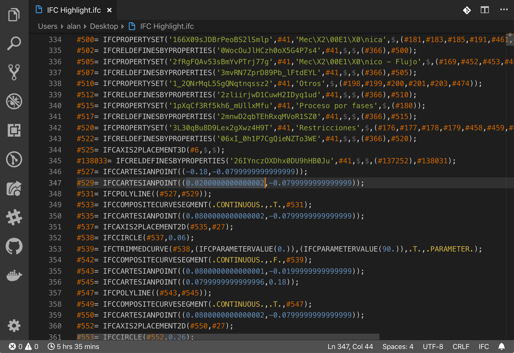
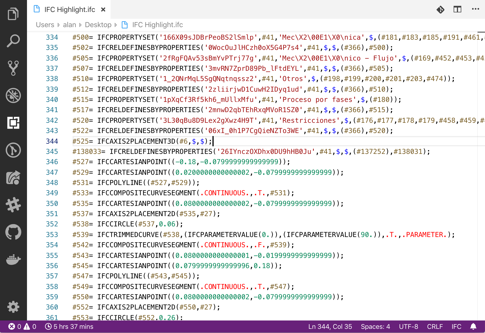
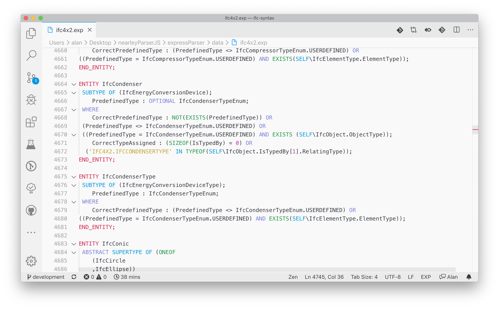
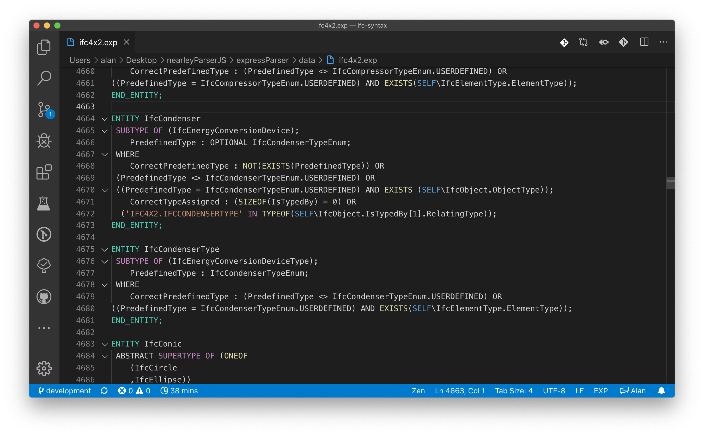

# IFC Syntax VSCode Extension

> This extension is in early stages of development. If you see a bug you want to report, please open an issue on GitHub.

## Description

***IFC Syntax*** is a Visual Studio Code extension that adds language support for Industry Foundation Classes (also known as IFC) files, using the `.ifc` extension, and for EXPRESS languate, using the `.exp` extension.

## Features

Currently it supports:

* Basic syntax highlighting for:
  * **IFC** (Industry Foundation Classes) files.
  * **EXPRESS** language files (commonly used to define the different IFC versions).
* Basic folding capabilities
  * **IFC:** Only HEADER and DATA sections can be folded.
  * **EXPRESS**:
    * *TYPE*, *ENTITY*, *FUNCTION*, *RULE* folding.
    * Main section folding.
* More features will be added in the near future.

## Screenshots

### IFC Files

### Express Files

## Known Issues

Currently, the entire *HEADER* section of the file will be colored as a comment, this will change in future releases.
